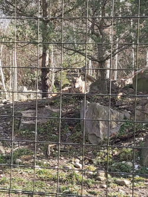
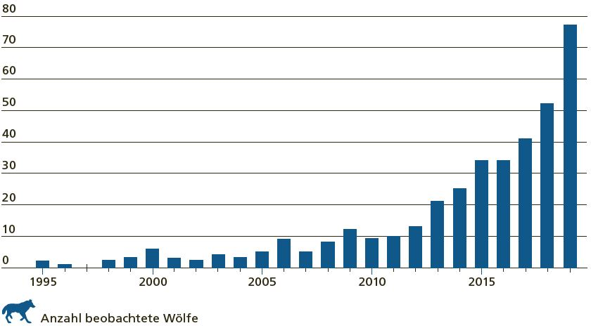
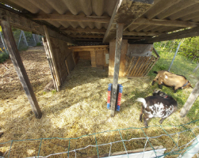

+++
title = "Das geschützte Raubtier"
date = "2023-06-01"
draft = false
pinned = false
tags = ["#Deutsch #Reportage"]
image = "wolfgraubuendenneu.jpg"
description = "Wölfe ziehen durch die Schweiz. Für die Menschen in den betroffenen Gebieten völlig normal und doch eine Bedrohung ihrer Existenz. Die Sorgen der Bauern steigen, sie wollen eine Regulierung und doch erhalten sie wenig Unterstützung. "
footnotes = ""
+++
**Wölfe ziehen durch die Schweiz. Für die Menschen in den betroffenen Gebieten völlig normal und doch eine Bedrohung ihrer Existenz. Die Sorgen der Bauern steigen, sie wollen eine Regulierung und doch erhalten sie wenig Unterstützung.**

Von **Lavinia Kunz und Viviane Auer**

Ein totes Tier mitten im Garten und der Gestank von Tod in der Luft. Ein halb gefressenes Reh liegt 15m entfernt des Schlafzimmers von Patrick Loretz und seiner Frau. Der Täter? Ein Wolf. Die Familie Loretz lebt im Kanton Graubünden auf ihrem Bauernhof. Herr Loretz ist sowohl als Bauer wie auch als Präsident der Geschäftsprüferkommission in der Gemeinde Vals, seinem Wohnort, tätig. Eine Nachbarin der Familie habe die Schreie des Rehs gehört, doch die Familie Loretz hat alles ruhig verschlafen. Jedoch ist der Anblick des toten Rehs leider nichts Neues. Seit dem letzten Herbst gab es bereits fünf Rehrisse, weshalb diese Situation für Herr Loretz schon fast zum Standard geworden ist. Das einzig Spezielle ist, dass das Wolfsproblem nun auch im Dorf und dadurch doch noch einmal etwas ernster geworden ist. “Es ist wie es ist”, meint Herr Loretz dazu und bleibt dabei ziemlich ruhig. Doch es gab auch andere Reaktionen auf den Zwischenfall. Eine Dorfbewohnerin konnte in den darauffolgenden Nächten nicht schlafen und auch sonst sind einige Bewohner vorsichtiger in ihrem alltäglichen Verhalten geworden. 

Herr Loretz selbst beschreibt das Gefühl nach dem Vorfall als ein mulmiges, welches sich besonders auf seine Kinder bezieht. “Was, wenn die Kinder zum falschen Zeitpunkt am falschen Ort sind?” Schon öfters wurden am Morgen Wölfe im Dorf gesichtet. Zu dieser Zeit sind die meisten Kinder auch auf dem Weg zur Schule. “Es könnte zu einer dummen Situation kommen”, erklärt Herr Loretz. Er fügt hinzu, dass Wölfe eigentlich nur in seltenen Fällen angreifen würden. Jedoch kann es zu solchen Situationen kommen, besonders dann, wenn sie sich eingesperrt oder umzingelt fühlen. 

Er selbst hat schon einige Schafe an Wolfsangriffe verloren und meint dazu, dass dies kein grosser Verlust wäre, wenn es in diesem Ausmass bliebe. Er selbst ist als Folge der Wolfsangriffe in den letzten Jahren im letzten Sommer mit mehr Herdenschutzmassnahmen als zuvor auf die Alpen gegangen. Auch dieses Jahr wird er wieder mit mehr Hunden, Hirten und Zäunen in die Berge gehen. Er selbst spricht sich für eine Wolfsregulation aus, da es seiner Meinung nach in den nächsten Jahren zu immer mehr Vorfällen kommen könnte. 

**\*Die Geschichte des Wolfes**
Durch das Aufkommen der Schusswaffen in der Schweiz, wurden die natürlichen Beutetiere des Wolfs ausgerottet, weshalb der Wolf vermehrt die Nutztiere des Menschen angriff. Durch den Nahrungsmangel und den vermehrten Abschuss des Wolfes reduzierte sich die Wolfspopulation in der Schweiz stark, bis schliesslich im 20. Jahrhundert nur vereinzelte Wölfe im Graubünden lebten.* 

**Eine radikalere Sichtweise**
Ein bisschen aufgebrachter über die Situation ist Stefan Geissmann. Auch er lebt im Graubünden. Er ist Ziegenhalter und Berater für Kleinwiederkäuer und in der Fachgruppe für Herdenschutzmassnahmen. Eingezäunte und von Herdenschutzhunden bewachte Herden gelten laut Gesetz als geschützt. Denn dann ist der Wolf gehemmt dort hineinzugehen, da, nach dem Stand der Forschung, Wölfe am liebsten einfach und schnell zu jagende Beutetiere verfolgen. Er will einen möglichst kleinen Energieaufwand während der Jagd haben. Der Wolf ist jedoch schlauer als viele denken. Er lernt, Schutzmassnahmen zu umgehen und kann sich trotzdem in die Herde einschleichen. Wenn er auf einen Zaun trifft, lernt er mit der Zeit diesen zu überspringen oder zu unterschlüpfen. Wenn er sieht, dass die Herde von Herdenschutzhunden bewacht wird, wartet er, bis die Hunde an einer anderen Stelle sind und schleicht sich ein. Doch vielfach ist es gar nicht möglich, die Herde einzuzäunen. Die steile Topografie und das ständige Herumziehen mit den Schafen wegen der Futtersuche erschweren es, einen dauerhaften Zaun aufzustellen und so verlässt man sich hauptsächlich auf die Herdenschutzhunde. Wenn Wölfe zuschlagen, reissen sie meistens nicht nur ein Schaf, sondern gleich mehrere. Die Schafe sind dann aber vielfach noch gar nicht richtig tot und man kann ihre kläglichen Schreie hören. Das wird sehr emotional. 

Stefan Geissmann erzählte eine Geschichte über einen befreundeten Ziegenhalter. Diese werden auf verschiedenen Weiden in einem Flexinetzzaun, auf dem genügend Strom steht, gehalten. Die meisten dieser Ziegen gehören seinen Kindern. Alle von ihnen haben einen Namen. Eines Nachts schaffte es ein Wolf, den Zaun zu überwinden und tötete mehrere Ziegen, da diese wegen des Zauns nicht fliehen konnten. Als am Morgen diese Familie kam, um die Tierkontrolle zu machen, bot sich ihnen ein schrecklicher Anblick. In solchen Situationen gibt es verschiedene Dinge, die man tun muss, unter anderem auch die noch nicht ganz toten Tiere von ihren Qualen erlösen. «So etwas schmerzt», sagt Stefan Geissmann. 

Viele ertragen es psychisch nicht mehr. «Wir haben uns nicht gewünscht, dass der Wolf zurückkommt», sagt Stefan Geissmann. Mit den Rissen durch Wölfe verlieren viele der Bauern einen beträchtlichen Anteil ihres Einkommens. Mit etwa 500 bestätigten Rissen durch Wölfe im Kanton Graubünden und weiteren mindestens 500 vermissten Schafen ist dies ein echtes Problem. Wenn der Wolf nur ein Tier reissen würde, wäre das ertragbar, doch das tut er nicht. Auch für die Herdenschutzhunde ist es herausfordernd und teilweise können sie nicht mehr arbeiten. 

Auch die Menschen in diesen Gebieten fühlen sich nicht mehr wohl. Sie sind in ihrer Bewegungsfreiheit eingeschränkt und sie machen sich Sorgen, zufällig in einen oder mehrere Wölfe zu laufen. Eines Morgens war ein kleines Mädchen auf dem Weg in die Schule, als sie einem Wolf begegnete. Vor lauter Angst versteckte sie sich eine lange Zeit in einem Busch, da der Wolf nicht weggehen wollte. Ein anderes Beispiel ist das eines 14-jährigen Mädchens, das mit ihrem Hund spazieren ging und zwei Wölfen begegnete. In solchen Situationen hat man natürlich grosse Angst, denn der Wolf könnte den Hund als Bedrohung sehen und angreifen. In Deutschland gab es schon schlimmere Vorfälle und die werden sich wahrscheinlich bald auch in der Schweiz häufen. Viel machen kann man nicht, denn der Wolf ist stark geschützt. Selbstschutz, wie beispielsweise Fallen, um das eigene Haus oder Dorf aufzustellen, ist illegal, doch wenn sich nichts ändert, werden die verängstigten Menschen wahrscheinlich solche Dinge illegal tun und das Ganze selbst in die Hand nehmen. 

Stefan Geissmann betont aber, dass er nicht die vollständige Ausrottung des Wolfes will. Eine Regulation sei aber unvermeidlich. Sie haben hauptsächlich Probleme mit denen, die nicht mehr scheu sind und sich vermehrt in den Dörfern herumtreiben. Die Abschüsse sind zurzeit sehr stark kontrolliert. Man darf einen Wolf erst schiessen, wenn dieser zehn Schafe aus einer geschützten Situation getötet hat. 

Momentan gibt es im Kanton Graubünden mindestens zehn Rudel und es werden wahrscheinlich noch weitere dazukommen. Tierschutzorganisationen sagen jeweils, dass der Wolf einen nicht angreift, wenn er sich nicht bedroht fühlt, doch Stefan Geissmann glaubt, dass Wölfe, oft von Tierschutzorganisationen und anderen, verharmlost werden. 

Allgemein gelten alle Tiere, welche nicht zu einer jagdbaren Art gehören, inklusive des Wolfes, in der Schweiz als geschützt. Doch für den Wolf gibt es weitere Gesetzesartikel, welche sich speziell auf die Regulierung von Wolfsrudeln beziehen. So kann ein Kanton mit der Zustimmung des BAFU die Wolfspopulation regulieren. Dies allerdings nur, wenn im Streifgebiet des Rudels, welches Jungtiere besitzen muss, mindestens 15 Nutztiere in einer Zeitspanne von vier Monaten getötet wurden. Dazu zählen nur Nutztiere, welche mit ausreichenden Herdenschutzmassnahmen geschützt wurden. Es dürfen maximal die Hälfte der Jungtiere, welche im entsprechenden Jahr zu Welt kamen, abgeschossen werden. 

**Artenvielfalt und Nutzen**

Eine andere Sichtweise als Herr Geissmann hat David Gerke. Er lebt im Kanton Bern und ist als Jäger tätig. Hauptsächlich schiesst er Wild für die Ernährungsgewinnung. Einen Wolf hat er noch nie geschossen, da diese geschützt sind und nicht von Jägern gejagt werden dürfen. “Und selbst wenn das nicht so wäre, würde ich keinen Wolf töten”, erklärt er. Denn für ihn gehören die Wölfe zur Artenvielfalt. Er würde sich weigern einen Wolf abzuschiessen, da der Wolf absolut notwendig für das Ökosystem sei und weil sie dabei helfen würden, die Bestände der Pflanzenfresser zu regulieren. “Die Regulierung des Wolfsbestandes ist nicht notwendig”, erklärt er. “Denn Risse lassen sich mit Regulierungen nicht verhindern.” 

Für ihn als Jäger stellt sich immer wieder die Frage, ob der Abschuss eines Tieres legitim ist. Und wenn ja, in welchen Fällen. Seine Meinung dazu ist klar, für ihn ist es legitim, wenn man das Tier nutzt, beispielsweise zur Ernährung. “Das Töten eines Wolfes hätte jedoch keinen Nutzen”, meint er. 

Doch auch für ihn gibt es Situationen, in denen der Abschuss eines Wolfes gerechtfertigt ist. Wenn ein leidendes Tier, beispielsweise ein kranker oder ein angefahrener Wolf, erlöst werden muss. Oder auch wenn ein Wolf die Scheuheit vor dem Menschen verloren hat, da dies eine Gefahr für Menschen in Gebieten mit Wolfspopulation sein kann. 

**Ein Blick in die Welt**
In Kanada fressen die Wölfe vor allem Mäuse und teilweise auch Fische. Die Karibus werden nur in gewissen Zeiten des Jahres gejagt, nämlich genau dann, wenn die Jungtiere alt genug sind, selbst an der Jagd teilzunehmen. Die Karibus sind aber sehr schnell und flink und deshalb eigentlich ziemlich sicher vor Wölfen. Selbst ein drei Wochen altes Jungtier ist von Wölfen nur schwer zu erlegen. Deshalb jagen die Wölfe vor allem kranke, schwache und alte Tiere. Dafür wenden die Wölfe verschiedene Jagdtechniken an. Bei einer grossen Herde wird sie zur Flucht getrieben, um ein schwaches Tier zu finden, das dann aussortiert und angegriffen wird. Wenn es kein solches Tier gibt, suchen die Wölfe eine neue Herde. Bei einer kleineren Herde treiben die Wölfe die Herde in einen Hinterhalt. Wenn es noch weniger Karibus hat, wird eine Art Staffelsystem angewendet. Ein Wolf treibt ein Karibu vor sich her, bis zum nächsten Wolf, der in einiger Entfernung wartet und dann seinerseits dann die Verfolgung übernimmt. 

«Es ist genau so, wie ich dir schon gesagt habe. Das Karibu nährt den Wolf, aber der Wolf hält die Karibus stark und gesund. Wenn es den Wolf nicht gäbe, dann gäbe es auch bald keine Karibus mehr, denn sie würden aussterben, wenn Schwäche und Krankheiten sich unter ihnen ausbreiten», sagt Ootek, ein Inuit aus dem arktischen Kanada. 

Doch trotz den Nachteilen und Gefahren, welche der Wolf mit sich bringt, ist er trotzdem noch ein Lebewesen, welches ein wichtiger Bestandteil unseres Ökosystems ist. Ein Lebewesen, das genauso das Recht auf Leben hat wie der Mensch. Ist es richtig, den Wolf zum Tode zu verurteilen, nur weil er auf der Suche nach Nahrung ist? Spricht das nicht gegen alle moralischen und ethischen Regeln, welche man besonders auch in Bezug auf die Fleischproduktion immer wieder predigt? Der Mensch sollte nicht über den anderen Lebewesen der Erde stehen. Doch durch den Abschuss von Wölfen vertritt man genau das. Dennoch ist es unmöglich den Wolfsabschuss ganz zu verbieten, da Wölfe teilweise auch eine Gefahr für die Menschen in den betroffenen Gebieten darstellen können, beispielsweise wenn sie die Scheuheit vor dem Menschen verloren haben.