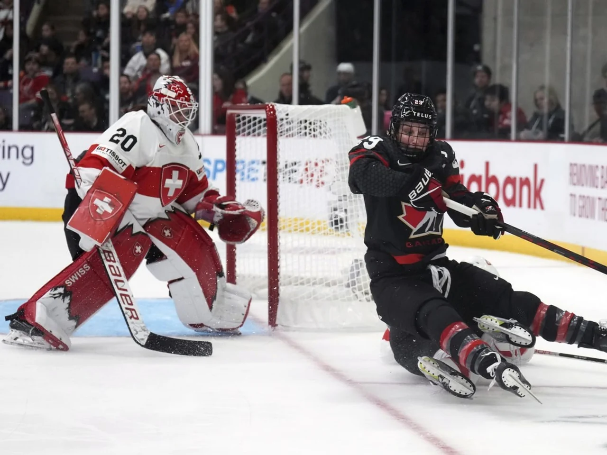

+++
title = "Schweiz schlägt sich gegen Kanada tapfer"
date = "2023-04-06"
draft = false
pinned = false
+++
<!--StartFragment-->

Die Schweiz hat gegen den 12-fachen Weltmeister wie erwartet zwar verloren. Doch die Equipe von Coach Colin Muller hat gegen die übermächtigen Kanadierinnen eine ordentliche Leistung abgeliefert. Goalie Andrea Brändli musste nur 4 Gegentore hinnehmen. Das ist einerseits ihren vielen Paraden zu verdanken, andererseits ihren Vorderleuten, die kämpferisch überzeugten. Die physische Präsenz der Schweizerinnen brachte jedoch auch viele kleine Strafen mit sich. Dies rächte sich zunächst.

## Schweiz verpasst Eherntreffer knapp

In der Folge funktionierte das Boxplay besser. Der 4. Gegentreffer durch Sarah Fillier fiel erst in den Schlussminuten. Das Schweizer Powerplay hingegen erzeugte zu wenig Gefahr. 1:05 Minuten lang hatte das Muller-Team in doppelter Überzahl agieren können, ehe Natalie Spooner (12.) der Führungstreffer gelang.